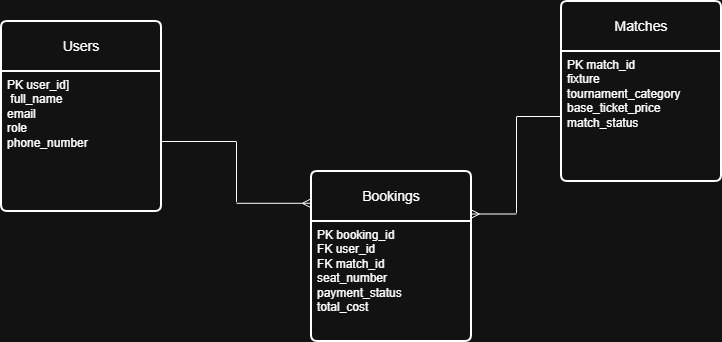

# Football Ticket Booking System

##  Assignment Overview

This project is a PostgreSQL database implementation of a **Football Ticket Booking System**. It was developed as part of a Database Management Systems assignment.

The project includes:

- Database table creation
- Primary Key and Foreign Key relationships
- Constraints
- Sample data insertion
- SQL queries demonstrating different PostgreSQL concepts

---

## Database Tables

The database consists of three tables:

### Users
Stores information about football fans and ticket managers.

### Matches
Stores information about football matches.

### Bookings
Stores ticket booking information by connecting users with matches.

---

## Entity Relationship

- One User can have many Bookings.
- One Match can have many Bookings.
- Each Booking belongs to one User and one Match.

---

## SQL Concepts Used

This project demonstrates the following SQL concepts:

- CREATE TABLE
- PRIMARY KEY
- FOREIGN KEY
- NOT NULL
- UNIQUE
- CHECK Constraints
- INSERT INTO
- SELECT
- WHERE
- ILIKE
- COALESCE
- IS NULL
- INNER JOIN
- LEFT JOIN
- Subquery
- Aggregate Function (AVG)
- ORDER BY
- OFFSET
- LIMIT

---

## Project Structure

```
Football-Ticket-Booking-System/
│
├── QUERY.sql
├── ERD.png
└── README.md
```

---

## File Description

### QUERY.sql

This file contains:

- Table creation
- Constraints
- Sample data insertion
- Solutions to all seven SQL queries required in the assignment

---

## Queries Implemented

1. Retrieve available Champions League matches.
2. Search users using ILIKE.
3. Replace NULL payment status using COALESCE.
4. Retrieve booking details using INNER JOIN.
5. Display all users including those without bookings using LEFT JOIN.
6. Find bookings with total cost higher than the average booking cost.
7. Retrieve the top two expensive matches after skipping the highest-priced match.

---

## ERD

The Entity Relationship Diagram (ERD) illustrates the relationships between the Users, Matches, and Bookings tables.


```md

```

---

## Technologies Used

- PostgreSQL
- SQL
- Draw.io
- Visual Studio Code
- Git
- GitHub

---

## Author

**Name:** Partha Chowdhury

**Assignment:** Football Ticket Booking System
